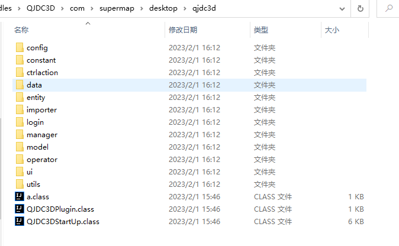
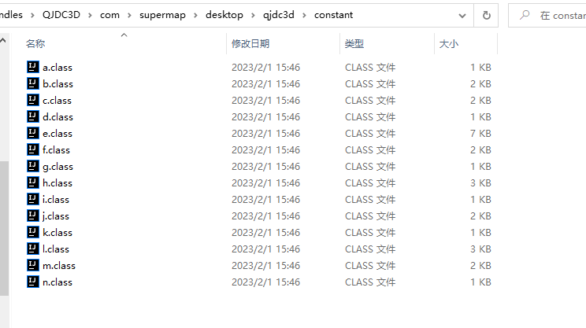
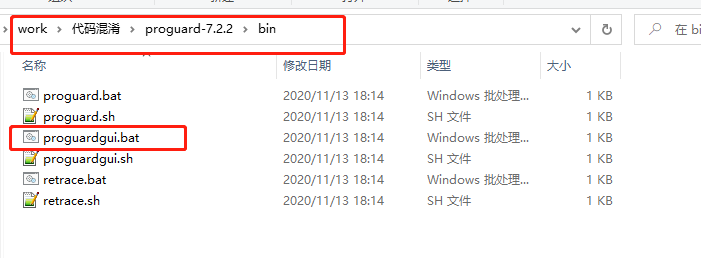
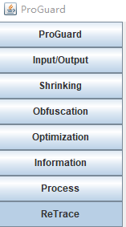
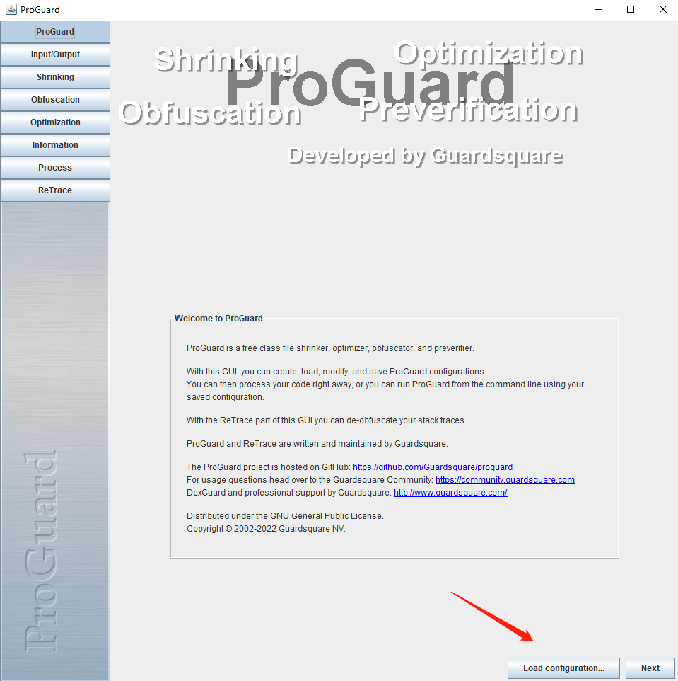
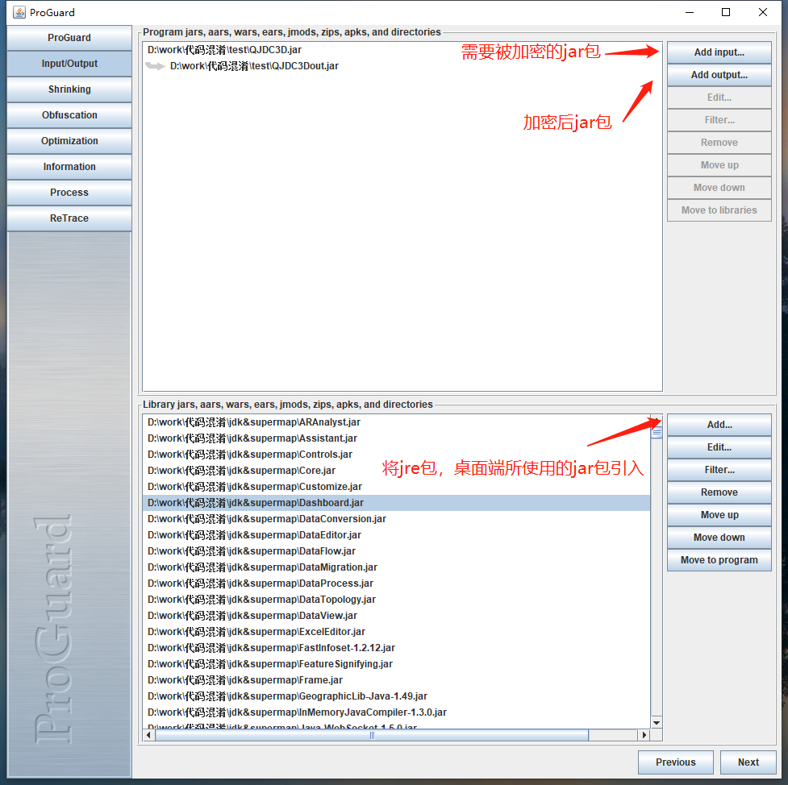
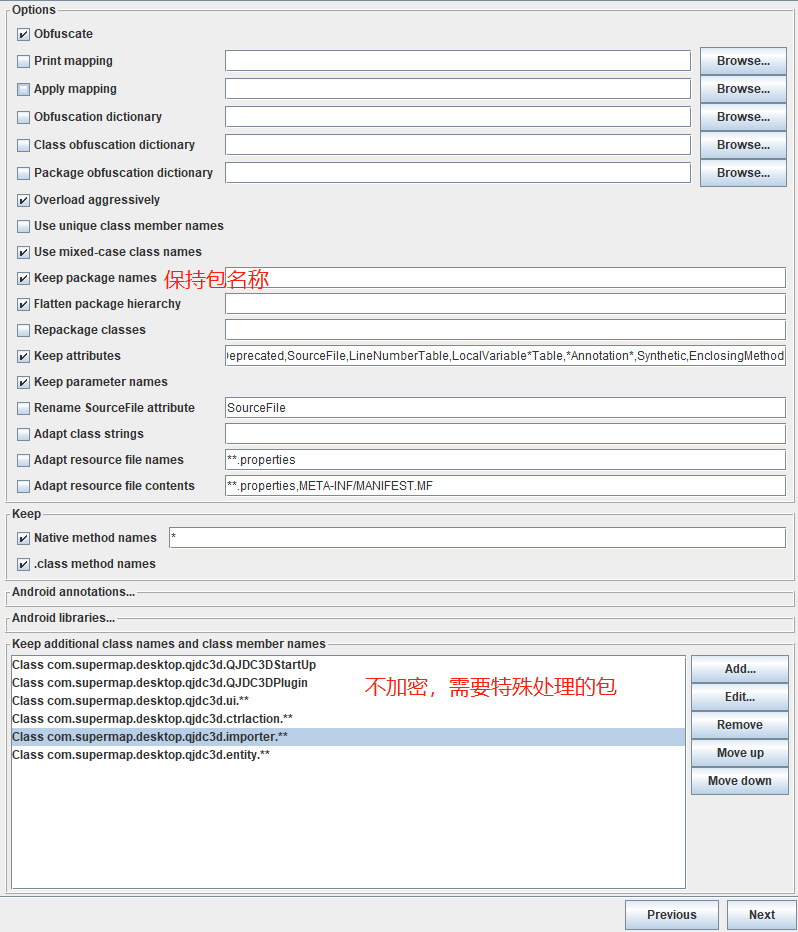
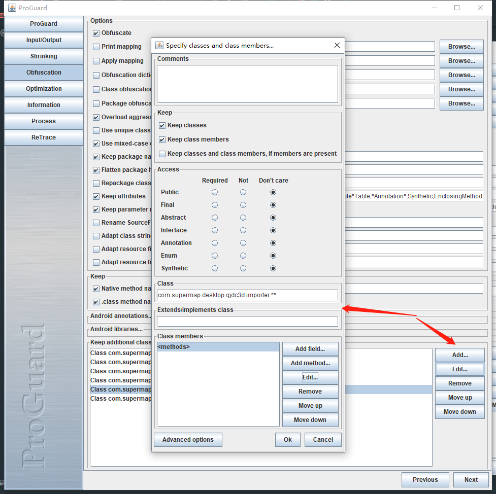
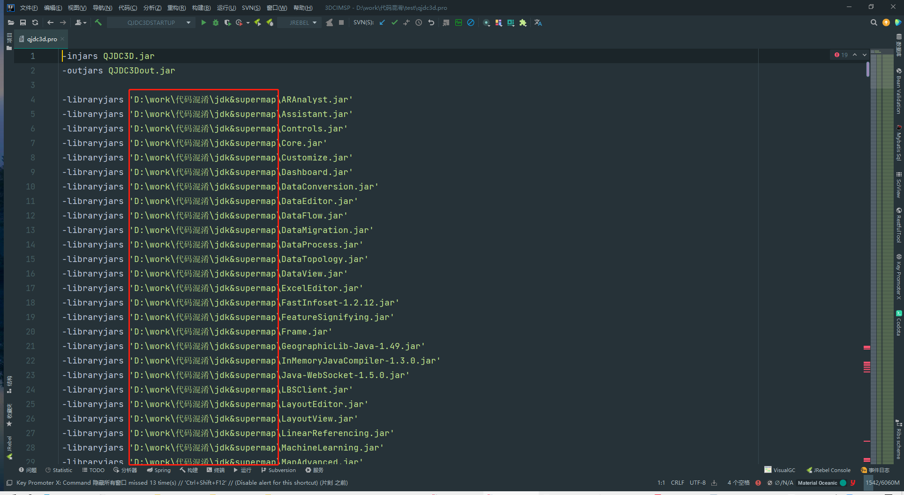

# 代码加密工具Proguard使用说明


系统、数据库性能测试记录

<!--more-->
# 代码加密工具Proguard使用说明

```
CreateBy lln
CreateTime 2023-02-01
ProguardVersion 7.2.2
```

## 一、需求背景

```
需要对提供给客户的Java客户端代码进行混淆，破坏其可读性，防止核心代码被反编译。
```

## 二、技术选型

```
采用 ProGuard 工具软件进行代码加密混淆工作。
ProGuard是Java类文件收缩器、优化器、混淆器和预验证器。可以使代码库更小、更有效、更好地抵御逆向工程。
官网地址
https://github.com/Guardsquare/proguard
参考博客
https://blog.csdn.net/weixin_44462773/article/details/124172382
```

## 三、混淆效果展示
```
对于包名称，不进行混淆（可在加密时进行配置，但不推荐，会影响反射调用）
对于类，进行名称混淆。
对于特定的文件，如启动类、资源文件，不进行混淆。
```



## 四、配置流程

以下是配置加密的步骤流程。

### 1 、打开GUI界面

通过官网下载最新的安装包，打开如图所示GUI操作界面，如下图所示。



### 2、功能菜单说明



```
ProGuard 主界面，用于加载配置文件
Input/Output 包选择界面，配置目标包信息和依赖包信息
Shrinking 代码收缩配置【未测试使用】
Obfuscation 代码加密配置
Optimization 代码优化配置【未测试使用】
Information 相关信息
Process 运行界面
ReTrace 回溯界面
```

### 3、加载配置文件

选择【Load configuration】加载【qjdc3d.pro】配置文件。




### 4、添加包信息

添加要加密的jar包、导出的jar包、依赖的jar包


### 5、进行加密配置

```
需要特殊配置的信息如下
1、项目代码的包结构，包的名称、不可变（影响部分反射代码）
2、ctrlAction相关的代码，类名称不可变（桌面端插件信息读取，需要扫描配置在xml中的类名称）
3、所有反射用到的实体类信息，字段及构造方法，不可变（有部分工具代码，是从dataset数据中通过实体对象的字段反射进行数据的匹配）
4、启动配置类，类名称、方法不可变（启动类有main函数）
```





## 五、采坑记录

```
1、所有参与了反射调用的代码、第三方框架的代码，通过类加载器进行特殊操作的代码，都不可变。否则会出现难以理解和调试的错误。如奇怪的Npe调用，奇怪的报错，程序秒退等。
2、不建议对包结构和路径进行改变，如名称混淆、压缩等。
3、在客户端插件系统中，不建议对代码进行压缩和优化操作，出现了很多无法处理的问题，如action无法识别，打不开部分功能。只建议进行加密操作。
```


## 六、配置文件修改步骤

```
加载配置文件后，导入的包路径，都不是自己的本地路径，可以将【.pro】文件打开，批量替换路径为自己的本地包，如下图。建议将jre的包和desktopx的所有包，都放在同一文件夹中，便于修改和关联。
```



## 七、思考和总结

```
1、如果需要代码加密工作，最好是在软件开发之初就进行规划，和不断集成测试。而不是在收尾阶段进行。
2、java代码的加密工作，注意事项，总得来说有2点，其一是所有和反射调用有上下文关联的代码，都要筛选出来进行特殊处理；其二是和资源文件关联的代码，也要注意不要因为特殊的混淆，导致文件名找不到而引发的后续报错。
3、如何进行有效的规划？最好在代码设计之初，就规划好哪些包需要加密（如核心算法，核心业务逻辑），在代码结构上加以区分，以便于后续处理。
```


